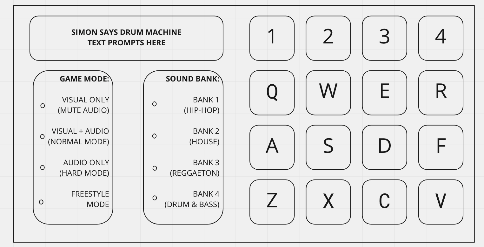

***Drum Machine Simon Says***

Link to Deployment: https://khakisuitvalentino.github.io/Unit1-Project1/

Pitch: 

-In the fashion of Akai MPC style drum machines, create a "Simon Says" style game using a four column, four row grid.

-This game will use audio and visual elements to guide the user through a sequenced pattern of "samples" (snippets of audio attached to each square in the grid) to test their sense of rhythm as well as their memory.

-Each square in the grid of 16 squares will correspond to a specific "sample". The sample sound may be a drum, a musical chord, a musical vocalization, a miscellaneous sound effect, or any combination of those.

-The user will have the option to play the game in four modes:

    - visual-only mode (class Simon Says style, with squares illuminating when pressed but no audio clues) 

    - visual-and-audio-mode (samples can be heard as well as squares illuminating when pressed)

    - audio-only mode (when the user becomes familiar with each sound in the grid, the computer will play a sequence of sounds and the user will play the sequence in the MPC grid)
    
    - freestyle mode (no memory testing; the user is free to play with the grid)

Wireframe:

Tech:

-The game will use HTML, CSS, and JavaScript, in DOM formation.

MVP:

-Create a UI with a 4 x 4 button grid, in the style of an Akai MPC or similar drum machine/sampler. The UI should also have a 'screen' to display text prompts, as well as buttons to choose the game type being played.

-Each 4x4 button should illuminate and play a sound when clicked, or when a corresponding key is pressed

-A function should perform in which the computer plays a sequence and then waits for user's matching input. If the user successfully matches the input then the function will begin again with a more challenging sequence. If the user fails to successfully complete the sequence, the computer will inform the user that the input was incorrect, and then give the user two more chances to successfully complete the sequence. After three tries, a "Game Over" message will display and the user will begin the sequences again from the beginning.

Stretch Goals:

-Sample packs with audio corresponding to different genres of music created on drum machines (ex. hip-hop, house, reggaeton), as well as corresponding 'Simon Says' sequences for each genre

-easy, medium, and hard modes for each genre

-A UI highly stylized after a real drum machine such as an MPC 2000 or SP-404

Post-Project Reflection:

-Unsolved Problems: Still trying to figure out how to get JavaScript to detect simultaneous inputs in arrays. With drum pad machines, it can be advantageous to press buttons simultaneously (see Demo loop for an example). However, in the game mode, an array is used to compare the user's input against the correct input iterated by the computer. I have not yet found a technique to record two inputs simultaneously in one node of an array.

-Growth Areas: This is the first project I have completed. I have learned more from developing this program than I have in all of my days of class combined.

Sources Used: I relied heavily on w3Schools, Stack Overflow, and various YouTube tutorials to help me write my code. I also extend a special thanks to my brother Brandon, who is a career software developer, for assisting me in troubleshooting bugs and optimizing code.